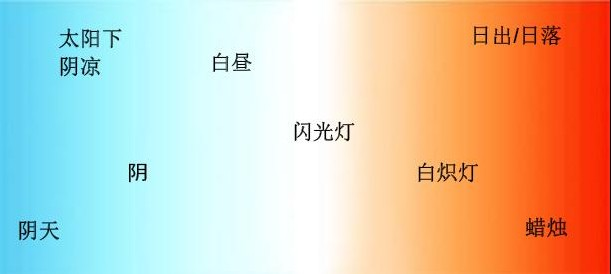
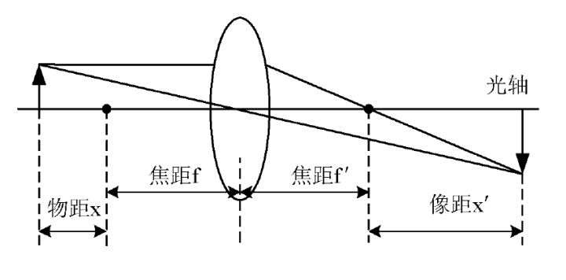

## 前言

又是一个巨大的挑战，我必须要在这4天的时间了看懂3A算法，而在此之前我连3A是什么都不知道。这篇文章目的是让在我学习、查找资料的过程中，同时整理和记录重要的概念和个人的理解。

## 3A技术是个啥？

3A技术是指：自动对焦（AF）、自动曝光（AE）及自动白平衡（AWB），这三种数字成像技术，通过3A技术来实现拍摄的图像对比度最大、改善主体拍摄物过曝光或曝光不足情况、使画面在不同光线照射下的色差得到补偿、从而呈现较高画质的图像信息。

#### 1. AF（自动对焦）技术

通过调整聚焦镜头的位置获得最高的图像频率成分。总的来说，已对焦图片比为对焦图片包含更高的频率成分，也就是相应的图片具有更高的对比度。获得最佳对焦点是一个不断积累的过程，它通过比较每一帧图像的对比度从而获得镜头移动范围内最大的对比度点，从而确定对焦距离。现在流行的自动对焦系统采用的是爬山算法（hill-climbing）。然而该算法也有一定的局限性，它只适用于图像本身色差较大的情况。

#### 2. AE（自动曝光）技术

自动曝光主要依赖于测光系统，照相机能根据测光系统所测得的被摄画面的曝光值，按照厂家生产时所设定的快门及光圈曝光组合，自动地设定快门速度和光圈值。当前主流照相手机中应用最广的自动曝光算法主要还是根据中性灰或者18%的反光率来获得一个合适的曝光值，如果景物中存在大面积的高反光率的表面(如白雪或沙滩)或大面积的低反光率的表面(黑色背景),根据中性灰或者18%的反光率所得到的曝光值也是当前照相成像质量的主要缺点。

#### 3. AWB（自动白平衡）技术

当在非理想的环境光条件下，原始图像中的白色成像的效果会偏向环境光的颜色，而不是纯白色，在高色温(如阴天)下偏蓝，低色温下偏黄，如宾馆里的床头灯。所以AWB算法的核心就是判断图像的色温，通过改变RGB感光电路信号的放大比例，让受环境光影响的白色还原成纯白色，保证在各种光线条件下，成像色彩跟物体真实的色彩保持一致。

## ISP（影像处理器）

说道3A技术，就不得不提ISP。ISP是Image Signal Processor的缩写，全称是影像处理器。在相机成像的整个环节中，它负责接收感光元件（Sensor）的原始信号数据。ISP的功能比较杂，基本上跟图像效果有关的它都有份。它内部包含多个图像算法处理模块，其中比较有代表性的是：扣暗电流（去掉底电流噪声），线性化（解决数据非线性问题），shading（解决镜头带来的亮度衰减与颜色变化），去坏点（去掉sensor中坏点数据），去噪（去除噪声），demosaic（raw数据转为RGB数据），3A（自动白平衡，自动对焦，自动曝光），gamma（亮度映射曲线，优化局部与整体对比度），旋转（角度变化），锐化（调整锐度），缩放（放大缩小），色彩空间转换（转换到不同色彩空间进处理），颜色增强（可选，调整颜色），肤色增强（可选，优化肤色表现）等。

随着用户对图像分辨率、画质的要求的提高，这些底层的图像处理算法大多都是在ISP中做。独立ISP芯片是独立于处理器而存在的，虽然成本较高，但优势也是比较明显的。除了运算能力、成像质量更优秀外，一般的独立ISP芯片都是手机商向ISP提供商定制的，所以与相机其他组件的契合度更佳，成像也有属于自己的风格、特色。集成的ISP会在手机CPU里，ISP的驱动程序可以说是手机成像算法，这与手机成像的好坏，有着关键因素。

## 自动对焦算法

#### 1. 对焦原理

相机聚焦的原理图如下（图像源于知乎）：

对于以上成像，要保证xx’=ff'，这样才能得到清晰的像。当物距x变化时，要么调节焦距f，要么调节像距x。

#### 2. 自动对焦算法

自动对焦的主要是通过不断采集实时图像，使用清晰度评价函数和其他信息为评判标准，驱动电机调节镜头的位置的，最终达到清晰的图像。在这其中找出一种比较合理的清晰度评价函数很关键，平常计算清晰度评价值的方法一般有这么几种（不全面，还有其他的很多）：

1. 第一种是频谱函数的方法，清晰的图像对比相应的不清晰图像在相应频谱分量上含有更多的信息，一种反映出来就是频谱函数的幅值，可以利用这种方法评价。
2. 第二种是信息熵，清晰的图像的信息熵大于相应的不清晰图像，这个原始证明很繁琐，所以这里用数据处理定理反证：a.清晰的图像处理后可以得到不清晰的图像。 b.但不清晰的图像无论如何处理都不能单独得到清晰的图像。 c.所以清晰图像的信息熵大于相应的不清晰图像，如果有方法计算出信息熵，则可以用熵来评价。
3. 第三种是梯度函数，在图像中梯度函数是一个可以衡量某变量变换率快慢的函数，正确对焦的图像有较为清晰的边缘，而在边缘的地方更为锐利，往往有变化率的最大值，或者说变化最不连续，如此一来也可以评价清晰度。

目前第三种方式是最为常用的，不过求梯度的算法有很多种，常见使用如：Tenengrad梯度（Sobel算子）、Laplacian梯度（Laplacian算子）。在使用清晰评价函数找最清晰的图像时，通常可以用爬山法，想清晰的方向、先粗后细的调节。当然爬山方法就肯定会遇到局部最小值的问题,需要对此进行优化，一种可行的解决思路是，在镜头位置调整电机的量程范围内很粗略的取一些采样点，粗布评估清晰度评估函数的值分布，然后再在此基础上做爬山算法。

## 自动曝光算法

在照相手机中，主要是通过改变曝光时间的长短和模拟/数字增益值而不是光圈值来控制曝光量的大小。自动曝光算法首先计算出当前的图像的亮度指标(注:亮度指标并不一定等同于亮度值)，并将他与理想的亮度指标比较。如果当前的亮度指标高于理想的亮度指标,自动曝光算法将指示控制电路缩短曝光时间或者减小模拟/数字增益值。反之则延长曝光时间或者增大模拟/数字增益值。这样直到当前的亮度指标和理想的亮度指标的差异小于设定的阈值或者曝光时间和模拟/数字增益值已达到极限值。**所以自动曝光算法的核心部分是如何定义和计算图像的亮度指标和理想的亮度指标。**

当前照相手机中应用最广的自动曝光算法假定景物中的全部反光面的平均反光率是18%。基于这个假定,图像的亮度指标就等同于整幅或部分图像的平均亮度值(Y),理想的亮度指标则被定义为最大亮度值的18%。

## 自动白平衡算法

#### 1. 灰度世界法

常用的一种自动白平衡算法是灰度世界法，它假设对于一副色彩丰富的图像，图像上RGB三个分量的平均值趋于同一个灰度值，一般取这个灰度值的大小为RGB三分量的平均值，通过计算RGB三个通道的各自平均值与总的平均值的差异作为比例系数，线性的调整每个通道值。在对图像的RGB每个通道线性的处理完之后，得到的值可能会存在溢出，对与这种情况一般采取两种方法：

1. 直接将像素设置为255，这可能会造成图像整体偏白。
2. 计算所有每个通道调整后的最大值，然后利用该最大值将将计算后数据重新线性映射到[0,255]内。实践证明这种方式将会使图像整体偏暗，建议采用第一种方案。

#### 2. 基于色温曲线和当前色温调整

色温曲线表示在不同色温下，图像要调整到正确白平衡时R、G、B通道矫正系数。色温曲线怎么获得呢？一般需要在不同色温下拍照，然后对这些图像分别做白平衡矫正，从而得到色温曲线。

有了色温曲线后，就只需要估测当前场景的色温值，然后对照色温曲线进行调整即可。那么责骂计算图像的色温呢？一般步骤如下：

1. 取一帧图像数据，并分成MxN块，并统计每一块的基本信息（白色像素的数量及R/G/B通道的分量的均值）。我们知道sensor原始图像是偏色的，怎么统计块中的白色点呢，那只有设置一个颜色范围，只要在范围中，就可以认为是白色像素。统计白色像素个数的用处是，第一如果块中的白色像素太少,可以抛弃掉；第二如果白色像素太多，多到每一个像素点都是，那也要抛弃掉，因为很可能在该区域过曝了。
2. 根据第1步中的统计值，找出图像中所有的白色块，并根据色温曲线判断色温，取最多的色温区作为图像的色温。
3. 

## 参考

1. *[相机的3A技术](https://www.cnblogs.com/lifan3a/articles/5006772.html)*
2. *[手机是如何实现自动对焦的?](https://www.zhihu.com/question/23636965)*
3. *[自动对焦综合性能指标及一种基于双向两次下降的自动对焦算法](http://xueshu.baidu.com/s?wd=paperuri%3A%28aaa645e2cb9a72d4ba90229dc906e199%29&filter=sc_long_sign&tn=SE_xueshusource_2kduw22v&sc_vurl=http%3A%2F%2Fwww.doc88.com%2Fp-0721510065379.html&ie=utf-8&sc_us=8719855203253845709)*
4. *[基于图像的自动曝光算法研究](https://wenku.baidu.com/view/c854fa93fd0a79563c1e72ba.html)*
5. *[一种适合照相手机的快速自动曝光算法](http://www.bzwz.com/html_news/news_45555.html)*
6. *[camera isp](http://blog.csdn.net/shenbin1430/article/details/6065444)*
7. *[数码照相系统中3A技术的分析与应用](https://wenku.baidu.com/view/f3c3fb61ddccda38376bafe7.html)*
8. *[基于灰度世界、完美反射、动态阈值等图像自动白平衡算法的原理、实现及效果](https://www.cnblogs.com/Imageshop/archive/2013/04/20/3032062.html)*
9. *[图像算法---白平衡AWB](http://blog.csdn.net/yapingmcu/article/details/50637797)*
