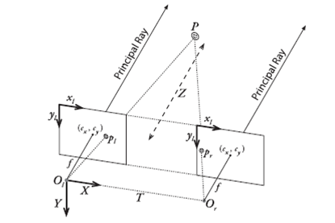

## 前言

双目视觉定位是目前机器（机器人）等领域中使用得非常广泛的视觉定位技术，双目视觉是模拟人的视觉系统利用两个不同位置的摄像头的视差来确定物体的位置。由于有需要采集两个摄像头的图像共同参与计算，所以双目相机装配要求高、标定也比单目复杂。相机的标定是定位的基础标定，本文是我学习双目视觉标定方法的总结文档。

## 为什么要标定

作为初学者，我们会有疑问，什么相机需要进行标定，标定到底有什么用呢？这是因为摄像机是将三维世界投射到二维平面的设备，从三维世界的场景到二维平面的成像图像，这两者的转化存在着一种映射关系，不同的相机映射关系不同，所以他们对相同场景所成像的图像也就不同，而标定的目的就是确定相机的这种映射关系。

总体来说，通过标定能够确定相机的内参、外参、畸变系数这三类参数，而这些参数就是确定相机将三维世界转为二维图像的最主要因素；而双目相机还要确认两个摄像头之间的位置关系，这是双目用于计算物体位置的前提。

## 相机模型

内参、外参、畸变系数这些东西是怎么来的？那我们首先要了解一下相机的成像原理和成像过程。相机的成像是一个物理光学现象，从光学基础来讲还是比较复杂的，但是在大多数时候我们只需要关注它最核心的部分，通过构建一些简单的模型来描叙问题的核心，从而近似的还原真实的物理现象。在相机模型中，我们两类最重要的模型就是：成像模型和畸变模型。

### 1. 成像模型

在成像模型里**针孔模型**（就是我们通常所说的小孔成像）是最常用的，它简单但有很好的描叙了相机成像的本质。下图为针孔成像示意图：

在相机中透镜充当了小孔的作用:

在相机的成像平面上放置的是光敏传感器，这些传感器会将成像平面上连续的图像进行采样，这样最终得到的是离散化的图像。在这里就会涉及到相机的**内参**：成像平面两个方向上传感器单位尺寸的像素密度、成像的中心位置和焦距，这5个参数（像素密度有两个方向）就是我们标定中要确定的主要的内参。

内参一般在相机生产后就比较固定，相对而言**外参**则是不固定的，因为外参表示的是相机自身在三维空间中相对于给定的世界坐标的位姿，这个位姿信息包括6个参数：三个位置参数、三个姿态参数，实际上两者就是一种线性映射关系。

### 2. 畸变模型

实际相机用透镜的聚光特性使得投影在成像平面上的光强度更大，成像质量会更好，但是也是由于凸镜的存在也会对图像产生不好的影响，如图像的畸变。

畸变类型和原因，主要有以下两点：

+ 透镜自身的形状对光线传播的影响——导致径向畸变
+ 在机械组装的过程中，透镜和成像平面不平行——导致切向畸变

在径向畸变可分为两类，如下图所示，左边为枕形畸变、右边为桶形畸变：

可以看到径向畸变只于图像到中心的距离有关，距中心越远畸变越大。对于径向畸变我们使用与中心距离r，相关的高次多项式模型来拟合，其中$r^2 = x^2 + y^2$：

$$x_distorted = x(1+k_1 r^2+k_2 r^4+k_3 r^6)$$
$$y_distorted = y(1+k_1 r^2+k_2 r^4+k_3 r^6)$$

切向畸变如下示意图：

我们新增参数p1、p2建立如下方程来拟合：

$$x_distorted = x+2p_1 xy+p_2 (r^2+2x^2)$$
$$y_distorted = y+2p_2 xy+p_1 (r^2+2y^2)$$

**统一两种畸变：**

$$x_distorted = x(1+k_1 r^2+k_2 r^4+k_3 r^6)+2p_1 xy+p_2 (r^2+2x^2)$$
$$y_distorted = y(1+k_1 r^2+k_2 r^4+k_3 r^6)+2p_2 xy+p_1 (r^2+2y^2)$$

上面统一的畸变公式，并不是将第一种畸变的公式整体代入第二个畸变公式，而是在无畸变图像上再增加两种畸变分量，而每种畸变分量只与无畸变图像相关，所以相互之间不影响，只不过径向畸变分量是乘性的而切向畸变是加性的。

根据畸变模型的公式，我们可以看到**畸变系数**主要是5个：k1、k2、k3、p1、p2，当然在实际中我们可以灵活选择，如畸变较小的镜头可以去掉高次项。

## 双目定位几何模型

成像模型和畸变模型是对单一镜头成像分析，而对于双目摄像头来说，它在成像的基础上还需要定位，因此需要建立一个能够计算物体位置的几何模型。

双目视觉的是模拟人眼，通过**视差**来计算物体的距离，从而得到物体的空间坐标信息，其几何模型如下图所示：

从上图可以看到，双目立体视觉的原理很简单，通过同一物体在两个图片中的视差和两个镜头光轴间的距离（基线），利用相似三角形就可以简单求出物体的距离。但是我们也要看到，此计算的基础是：$\underline{两个摄像机的成像平面在同一平面上，当然为了计算简单，我们还希望两个相机的中心能水平对齐，这样我们计算视差只需要用到两个图像单个坐标方向上值}$。

但是在实中是不存在完全共面的两个镜头的，所以在双目相机的标定中，我们除了确定单个相机的内外参数、对图像的畸变进行校正外，还需要对进行**立体校正**，立体校正的目的就是将实际中非共面对准的两个图像，校正到共面对准，注意这是对图像做的，因为相机镜头已经固定了。

可以看到，为了将两个图像调整到同一平面且中心水平对齐（外极线校准），我们需要知道两个摄像头的相对位置关系，具体来讲就是：旋转矩阵R和平移矩阵T，然后对应将图像做旋转和平移即可。获取立体校正的参数就是**立体标定**要做的工作，实际上只是对每个镜头进行前面单目标定，用单目标定的参数计算得到立体校正的参数。

以标定物体上的点为参考，可以分别得到左右相机的参考坐标系的坐标表达式，综合两者可以得到从左相机坐标系到右相机坐标系的转关关系，（推导下式其实是很简单的，但是网上的一些资料很少写清楚下面这个公式，有些写出来了也是不对的）：

$$R = R_r R_l^{-1}$$
$$T = T_r - RT_l$$

其中，Rr、Tr、Rl、Tl都是通过单目标定得到的参数，这样我们就可以直接求出立体校正的参数。

到此，整个双目视觉需要标定原因、各种标定的原理就讲解完成。

## 参考

1. *《视觉SLAM十四讲》——5.1 相机模型*
2. *[相机的那些事儿 (二)成像模型](https://zhuanlan.zhihu.com/p/23090593)*
3. *[双目视觉几何框架详解](https://www.cnblogs.com/dverdon/p/5609124.html)*
4. *[双目视觉的立体标定方法](https://wenku.baidu.com/view/56017f34f111f18583d05abe.html)*
