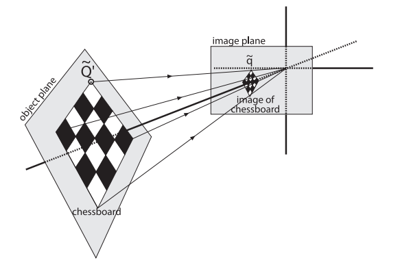

## 前言

上一篇文章说明了其各种标定参数的作用和原理，现在看看这些参数的实际标定方法。对于双标定，我们要获取的参数是四类：内参、外参、畸变参数、立体校正参数，其中畸变参数的计算需要结合内参和外参共同优化得到，而立体校正参数可以直接由内参和外参直接计算得到，所以虽然是双目相机，但是每一个镜头各自的内参和外参的获取仍然是标定的重点。

## 内参和外参的数学表示

前面我们分析过相机的内参和外参的物理意义和计算原理，不过当我们计算时，为了保证其数学形式的简洁，通常使用矩阵来表示。从三维世界的坐标点到数字图像中的坐标点，其映射关系用矩阵方法可以表示为：

$$ s_0m=K[R,T]X $$

X是世界坐标系中的点坐标，m是数字图像中点的坐标，使用的是齐次坐标形式，K是相机的内参矩阵，R是相机相对世界坐标系的旋转矩阵、T是平移矩阵，$s_0$为缩放因子。

### 1. 内参矩阵

相机的内参包括：两个方向的像素密度、光轴在成像平面的中心位置、相机的焦距，从上面也可以看到我们在计算中使用的是内参矩阵（Camera Intrinsics）：

$$ K = 
\left(\begin{array}{cc}
f_x & 0 & c_x\\
0 & f_y & c_y \\
0 & 0 & 1
\end{array}\right)
$$  

其中$f_x$为在x方向焦距长度上拥有的像素个数，$f_y$为在y方向焦距长度上拥有的像素个数，称为摄像机在x轴和y轴方向上的尺度因子，使用它可以让内参矩阵形式更加简洁。它们可以由针孔模型和图像数字化采样直接推出：

$$
f_x = a_x f \\
f_y = a_y f \\
$$

上式中$a_x$和$a_y$分别表示x方向和y方向上的像素密度，f表示相机的焦距；另外$c_x$为中心在x轴上的像素偏置，$c_y$为中心在y轴上的像素偏置。至此内参矩阵就讲所有相机内部参数都包含进去了。

但是在实际中，由于制造工艺的限制，传感器上横向的像素和竖向的像素排列不是绝对的垂直，所以在内参中我们需要加入一个倾斜因子s：

$$ K = 
\left(\begin{array}{cc}
f_x & s & u_0\\
0 & f_y & v_0 \\
0 & 0 & 1
\end{array}\right)
$$ 

不过需要注意的是，由于加入的倾斜因子，内参矩阵中个元素与相机各个参数的对应关系都要将倾斜因子考虑进去。

### 2. 旋转和平移的齐次表示

R和T是相机的外参，对应相机相对世界坐标系的旋转和平移，这里可以直接用刚体的坐标表换来计算，旋转用旋转矩阵R表示，平移用平移向量T来表示。不过有时候使用齐次矩阵统一旋转矩阵和平移向量能够让计算更简洁方便。

## 张正友标定法

### 1. 简介

相机标定主要有传统标定方法和自标定方法两类：

+ 传统标定方法需要标定参照物，参照物的参数已知，然后分析拍摄到的参照物图像，求得相机参数，传统方法操作相对复杂，但精度较高
+ 自标定方法不依赖于标定参照物，只领用摄像机的运动约束或者环境的约束来进行标定，自标定方法灵活方便，但由于是非线性标定，精度和鲁棒性都不高

张正有平面标定法也称张氏标定法，属于传统的标定方法。张氏标定只要求从不同的角度对同一平面拍摄2幅以上的的图像，就可以求出摄像机的内外参数。由于其平面模板（棋盘格）制作简单且不需要知道平面移动的具体的位置信息，即有穿透方法的高精度的优点、又相比其他传统的标定法要简单灵活，因此在业界得到了广泛使用。

标定所用的棋盘格如下,一般会将其打印出来贴在平面木板上当做标定物：

### 2. 单应性映射

由于我们的标定物是棋盘平面，所以棋盘平面的成像实际上是**单应性映射**（Homography）。那什么是单应性映射？单应性变换是同一物体在不同平面的投影，那么一个投影平面到另一个投影平面的映射关系就是单应性映射。由于单应性映射是在普通的线性变换的基础上增加了额外的约束条件，所以单应性映射会更简单：由于两个被物体都是平面，所以我们可以把变换前后的两个坐标系都建立在平面之上，那么前后两个平面的坐标都可以只用两个坐标值表示。两个平面的单应性映射关系用**单应性矩阵**来描叙，在张正友标定法中我们直接求得的是单应性矩阵。

单应性映射矩阵方程为：

$$ 
\left(\begin{array}{cc}
u \\
v \\
1 
\end{array}\right)
= H\left(\begin{array}{cc}
x\\
y \\
1 
\end{array}\right)
$$

可以看到，前后连个平面的点都只用了两个坐标值的齐次坐标表示，其中H为3x3单应性矩阵，9个元素值全部未知；不过由于是齐次方程，通常将H提取一个比例系数，让其最后一个元素值为1，只需求得8个未知数即可。每一个点对对应一个矩阵方程，一个矩阵方程对应三个方程组，但是由于是齐次方程，需要去除一个比例系数，实际上一个单应性矩阵方程只能提供两个有效的方程组，因此为了求解H，所以至少需要四个对应点。

### 2. 从单应性矩阵计算相机内参与外参

结合本文最开始的单个相机的成像坐标转换公式，使用单应性变换，则单应性矩阵为：

$$ H=[h1 h2 h3]=λK[r1 r2 t]$$

其中K仍然是内参，λ为比例系数，r1、r2、t为外参矩阵的一部分，计算将H拆解为（h1, h2, h3）的向量，取与r1和r2相关的方程，然后结合r1和r2的两个约束条件：

1. r1和r2位正交
2. r1和r2都为单位向量（模为1）

可以得到如下两个消除了r1和r2，用来计算内参K的方程组：

$$
h_1^T K^{-T} K^{-1} h_2 = 0 \\
h_1^T K^{-T} K^{-1} h_1 = h_2^T K^{-T} K^{-1} h_2
$$

内参矩阵K有5个未知量（加入了倾斜因子），每一个单应性矩阵只能得到两个上面的方程组，所以至少需要3个不同的单应性矩阵，即相机需要拍摄棋盘格三种不同的姿态。

得到了内参矩阵后，外参可以直接通过以下公式推出（由之前的推导得到）：

$$
\lambda =\frac{1}{\|A^{-1}h_1\|}=\frac{1}{\|A^{-1}h_2\|} \\
r_1=\frac{1}{\lambda}K^{-1}h_1   \\
r_2=\frac{1}{\lambda}K^{-1}h_2   \\
r_3 = r_1 \times r_2 \\
t=\lambda K^{-1}h_3
$$

### 3. 径向畸变估计

张氏标定只关注了影响大的径向畸变，根据径向畸变模型，我们有联系畸变后的联系畸变后的坐标和畸变前坐标的方程。一般为避免解非线性方程组，我们使用多个图像多个角点，使用最小二乘法，以畸变前后的坐标差异最小化为目标，迭代优化。

### 4. 用最大似然估计优化参数

在上面推导的是理想的结果，在实际成像中会受到噪声的干扰，我们认为噪声服从高斯分布，所以在张氏标定中我们用高斯分布来拟合，然后用最大似然法估计内外参数的最优结果。

具体做法是：

1. 求出理想的内参值
2. 拍摄多幅棋盘图像，用理想的内参求出不同姿态图像的外参
3. 用理想的内参和外参预测每个图像中的每个角点的成像坐标，用实际拍摄得到的坐标作为真值，可以得到每一个预测值在高斯分布下的可能的概率。
4. 使用极大似然法，将所有的预测概率相乘得到似然函数
5. 以理想内参为初值，迭代优化，让似然函数取得最大值

中间的数学推导我就不写了，简化后最终优化的函数如下：

$$
\sum^n_{i=1}\sum^m_{j=1} \| \hat{m}(K,R_i,t_i,M_{ij})-m_{ij} \|^2
$$

上式需要让其取最小值，优化算法一般用Levenberg-Marquardt算法（一种介于牛顿法与梯度下降法之间的一种非线性优化方法）迭代求解。

## 总结

总结整个张氏标定过程包括如下步骤：

1. 打印一张棋盘格，把它贴在一个平面上，作为标定物
2. 通过调整标定物或摄像机的方向，为标定物拍摄一些不同方向的照片
3. 从照片中提取棋盘格角点
4. 估算理想无畸变的情况下，五个内参和六个外参
5. 应用最小二乘法估算实际存在径向畸变下的畸变系数
6. 极大似然法，优化估计，提升估计精度

## 参考

1. *[A Flexible New Technique for Camera Calibration](https://www.microsoft.com/en-us/research/wp-content/uploads/2016/02/tr98-71.pdf)*
2. *[相机的那些事儿 (三)参数标定](https://zhuanlan.zhihu.com/p/23090766)*
3. *[双目视觉的立体标定方法](https://wenku.baidu.com/view/56017f34f111f18583d05abe.html)*
4. *[摄像机模型与标定(4)——单应矩阵](http://blog.163.com/wang_ly2442/blog/static/9494340720137552058132/)*
5. *[张正友标定算法原理详解](http://blog.csdn.net/u010128736/article/details/52860364)*
