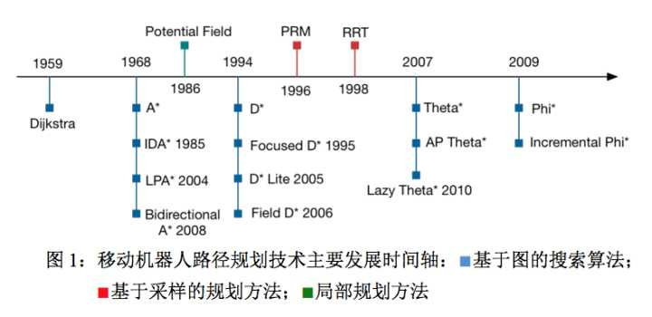

## 前言

前一段时间，我特地整理了一下各种基本的搜索算法，而这一次则将问题具体化，专门针对机器人的路径搜索与规划做讨论。

## 总体介绍

正如上一篇文章所讲到的那样，因为有不同的搜索对象不同的搜索目的所以才有各种各样的搜索算法。对于路径规划，我们的搜索的对象是：所处空间的路径；我们搜索的目的是：找到最短（最优）的可行的路径。为了问题的简化，我们先假定我们所处的环境是一个二维的空间。

路径规划是实际应用中经常遇到的问题，特别是在当前移动机器人的应用中。对于移动机器人的路径规划算法已经有比较久的历史，我在知乎上找到了一张很全面的图，很清晰的展示了各种路径规划算法的出现时间：

## 分类

可以看到，在上面所展示的算法中，主要就是量大类：基于图和基于采样，而基于图搜索算法的占据了绝大多数位置。而实际上这样分类是有点概念重叠的，因为基于采样的的路径规划算法也可能会用到基于图的算法。知乎上有网友做了详细的总结，我这里就照抄。

两大类：
1. 完备的（complete)
2. 基于采样的（sampling-based）又称为概率完备的

#### 1. 完备路径规划算法

所谓完备路径规划就是：如果在起始点和目标点间有路径解存在那么一定可以得到解，如果得不到解那么一定说明没有解存在。通常基于图的算法一般是完备的，如我们常用的：Dijkstra，A\*

+ 优点：总能得到明确的结果（如是否存在从起点到目标点的路径），且结果是肯定可信的
+ 缺点：算法量大

#### 2. 基于采样的路径规划算法

这种算法一般是不直接在grid地图进行最小栅格分辨率的规划，它们采用在地图上随机撒一定密度的粒子来抽象实际地图辅助规划。如PRM算法及其变种就是在原始地图上进行撒点，抽取roadmap在这样一个拓扑地图上进行规划；RRT以及其优秀的变种RRT-connect则是在地图上每步随机撒一个点，迭代生长树的方式，连接起止点为目的，最后在连接的图上进行规划。

+ 优点：计算速度快
+ 缺点：规划的路径不如完备的算法好，而且有有解无法求解得的情况

#### 3. 其他

另外有一些综合性的算法，如D* 、势场法、DWA(动态窗口法)、SR-PRM，它们属于在动态环境下为躲避动态障碍物、考虑机器人动力学模型设计的规划算法。

## 基于采样的路径规划

基于图的算法，前面已经讨论过了，现在重点整理一下基于采样的算法。

#### 1. 随机路标图（PRM）法

PRM将连续空间转换成离散空间，再利用A\*等搜索算法在路线图上寻找路径，以提高搜索效率。这种方法能用相对少的随机采样点来找到一个解，对多数问题而言，相对少的样本足以覆盖大部分可行的空间。演示如下图：

一般的PRM大体可分为两个阶段：离线学习阶段和在线搜索阶段。离线学习阶段的主要目的是在搜索空间中建立一张离散的地图，首先在整个搜索空间里随机散点作为图的端点，要求满足每个点与障碍物无碰撞。然后通过一个的局部规划器来为每个节点寻找他们的邻居节点并连接成边，同样要求边与障碍物无碰撞。局部规划器的作用是判断两个基点是否是邻居，将端点连接成无向图roadmap。局部规划器的规则是认为制定的，一般除了要求边与障碍物无碰撞外还要求：1.领域点的距离在一定范围；2.领域点的个数有上限。

完成了搜索图的连接后，就是在线搜索阶段。在线搜索阶段的任务是在给定初始点和目标点的条件下，根据离线阶段构建的路标图，搜索出一条连接s与g的可行路径，搜索算法一般可以采用Dijkstra、A\*。在这里要注意两点：一是起点和终点需要首先接入路标图网路中；二是在完成路标图中边的路径后可以用平滑的方法。

#### 2. 快速随机搜索树(RRT)

## 参考

1. *[有哪些应用于移动机器人路径规划的算法？](https://www.zhihu.com/question/26342064)*
2. *[机器人学 —— 轨迹规划（Sampling Method）](https://www.cnblogs.com/ironstark/p/5537323.html)*
3. *[PRM路径规划算法](http://blog.csdn.net/chauncygu/article/details/78032283)*
